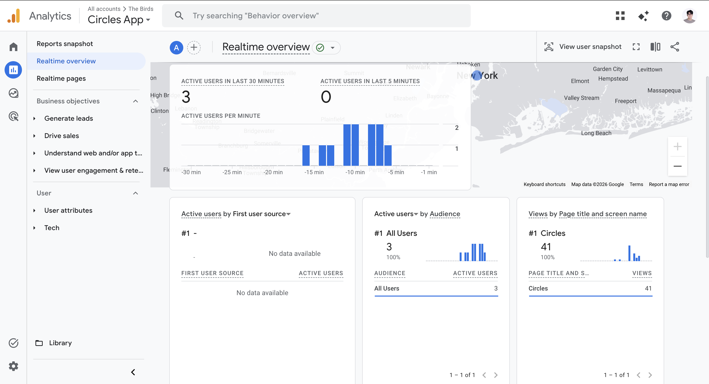
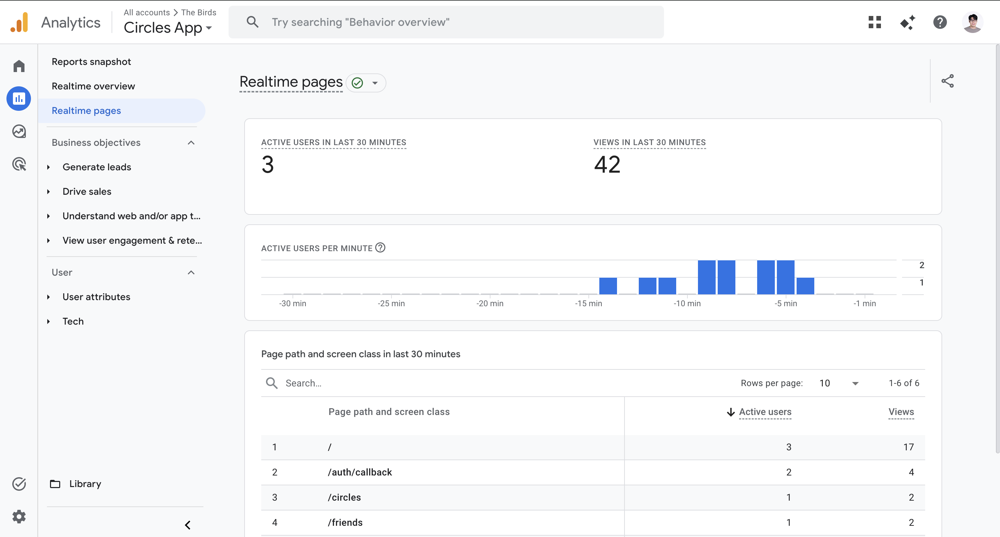
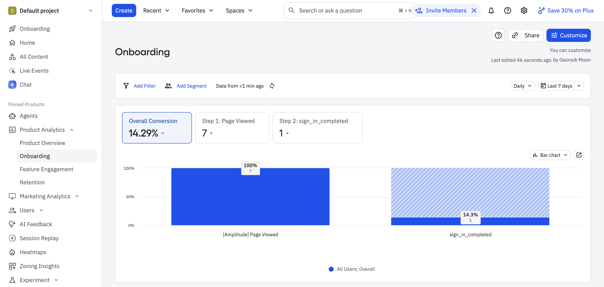

# Analytics Snapshot

**Product:** Circles  
**Live URL:** https://circlesmain.vercel.app/  
**Snapshot date:** May 11, 2026

## Dashboards

### GA4 Realtime Overview

GA4 confirms that analytics are live on the Circles app. At the time of the snapshot, GA4 showed **3 active users in the last 30 minutes**, **41 views** for the Circles page title, and realtime user activity in the New York area.

### GA4 Realtime Pages

GA4 page-level realtime data showed **42 total views in the last 30 minutes** from **3 active users**. The top paths were `/` with **17 views**, `/auth/callback` with **4 views**, `/circles` with **2 views**, and `/friends` with **2 views**.

### Amplitude Event Segmentation

Amplitude confirms the onboarding funnel events are live. The funnel is measured over the last 7 days from **Page Viewed** to **sign_in_completed**.

## Funnel & Conversion

Our critical path is:

1. **Visit Circles** (`Page Viewed`) - 7 users
2. **Complete campus sign-in** (`sign_in_completed`) - 1 user (14.29% from Step 1)

## Analysis

**Where is your biggest drop-off?**  
Our biggest drop-off is between viewing the app and completing sign-in. Over the last 7 days, **7 users viewed Circles, but only 1 completed campus sign-in**, so **6 of 7 visitors dropped before authentication**. That is an **85.71% drop-off** and a **14.29% conversion rate**.

**What do you think is causing it?**  
The likely issue is that visitors can see the feed, but the app does not yet create enough urgency or confidence to justify signing in with a Columbia/Barnard Google account. The campus-gated auth flow is important for trust, but it adds friction before users have fully understood the payoff. GA4 also shows most realtime activity concentrated on the home page, which suggests people are browsing before deciding whether to commit.

**What will you do about it?**  
We will make the sign-in moment more value-driven. First, we will add more contextual sign-in prompts around high-intent actions like joining a circle, seeing who is attending, and drawing a circle, rather than relying mostly on a generic sign-up button. Second, we will seed more active, recognizable Columbia circles so visitors see social proof before auth. Third, we will test copy that explains the trust reason for campus-only sign-in: Circles is limited to Columbia and Barnard students so the feed stays local and safe.

## Instrumentation Notes

GA4 and Amplitude are installed on the live Circles app. For this snapshot, we simplified onboarding measurement to a two-step funnel: `Page Viewed -> sign_in_completed`.
